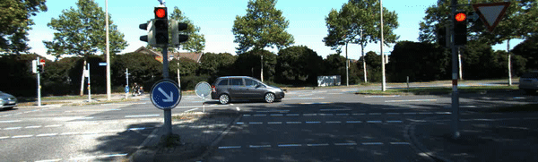

# Real time speed detection using Stereo vision setup

This is code implementation of the Real-time speed detection 
[Speed Detection Report](https://drive.google.com/file/d/1nDjnJwIkdP9NIfwu7b7xc5iGy94oDs-Q/view?usp=drive_link)<br/>


<a href="https://colab.research.google.com/drive/1HH9CrC8LlIetYgAGQsY1c4f8DR0AWBQj?usp=sharing"></a>


## Abstract
As Intelligent Transportation Systems continue to evolve and advance, there is a growing focus on achieving real-time and precise detection of speed information. Researchers are increasingly drawn to video-based vehicle speed detection using machine vision, appreciating its practical convenience and various benefits. This report describes a real-time speed detection system that uses stereo vision to estimate obstacle depth i.e. distance from the camera. By integrating YOLO for object identification and DeepSORT for tracking, our system is able to monitor dynamic traffic scenarios in real time with accuracy and efficiency. The report shows the effectiveness of our method by outlining the system architecture, implementation specifics, and outcomes. Under the direction of Professor Dr. Ayan Mondal, this research showcases the potential of tate-of-the-art technology for improved speed detection, marking a significant advancement in intelligent transportation systems.


## Setup

To use in Colab : open <a href="https://colab.research.google.com/drive/1HH9CrC8LlIetYgAGQsY1c4f8DR0AWBQj?usp=sharing"></a>

<br>
For Local system setup:

Assuming a fresh Anaconda distribution
``` shell
conda env create -n speed_detect --file environment.yml python=3.8.18
```

Clone the repo
``` shell
git clone https://github.com/ShubhamPednekar19/realtimeSpeed-Yolov7-Deepsort-stereovision.git
``` 

Download the required pre-trained checkpoints of the models (Yolo, Deepsort, IGEV)
* [YOLOv7](https://drive.google.com/file/d/1Lx5Op817Fn4cogrA9N6ea2iQ71sgg0B4/view?usp=sharing)
* [DeepSORT](https://drive.google.com/file/d/1Li6Badv7HKZ6ed0Gjmsxmmu1VrKk6ADG/view?usp=drive_link)
* [IGEV](https://drive.google.com/file/d/1LoDPLkoDsbUS2B2Swzrhn0jDc-AL96QA/view?usp=drive_link)

<br>
Create a `pretrained_models` folder and arrange the downloaded files as follows

```
├── /pretrained_models
    ├── deepsort
        ├── mars-small128.pb
    ├── kitti15
        ├── kitti15.pt
    ├── Yolov7
        ├── yolov7.pt

```

To See the inference of First part : Object detection and Tracking
``` shell
python tracking.py
```
To see the Disparity and Depth map:

For image:
``` shell
python depthImage.py --restore_ckpt ./pretrained_models/kitti15/kitti15.pth --left_imgs path_to_left --right_imgs path_to_right 
```
For video:
``` shell
python depthVideo.py --restore_ckpt ./pretrained_models/kitti15/kitti15.pth --left_imgs path_to_folder --right_imgs path_to_folder
```

For Speed Detection on the video:
Update the left and right video path in code, we will add the argument inputs shortly
``` shell
python speedDetect.py
```


## Inference
<p align="center">
  
  
</p>
<p align="center">
  Left camera video | Disparity view 
</p>

<p align="center">
  
  
</p>
<p align="center">
  Depth Map of video | Speed detection of objects 
</p>
